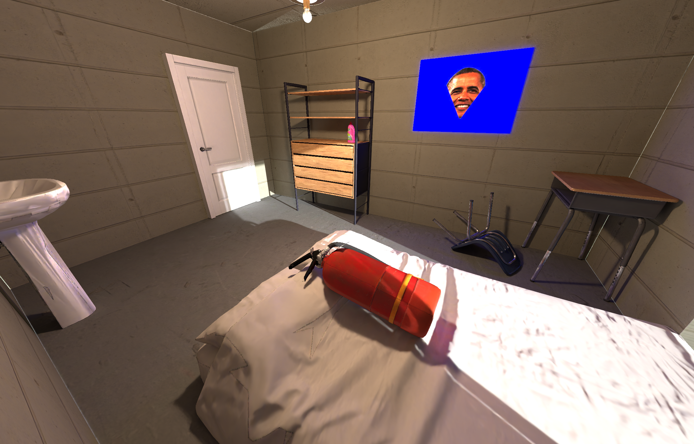
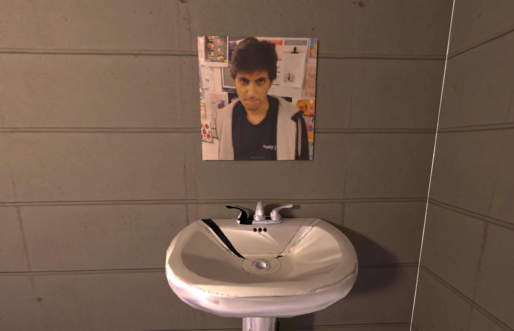
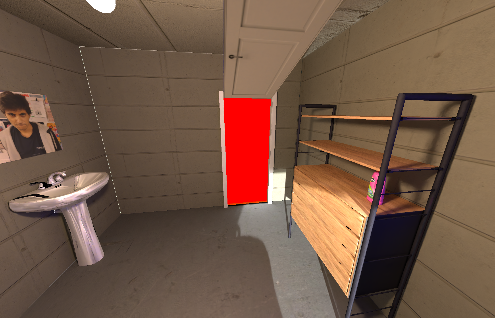
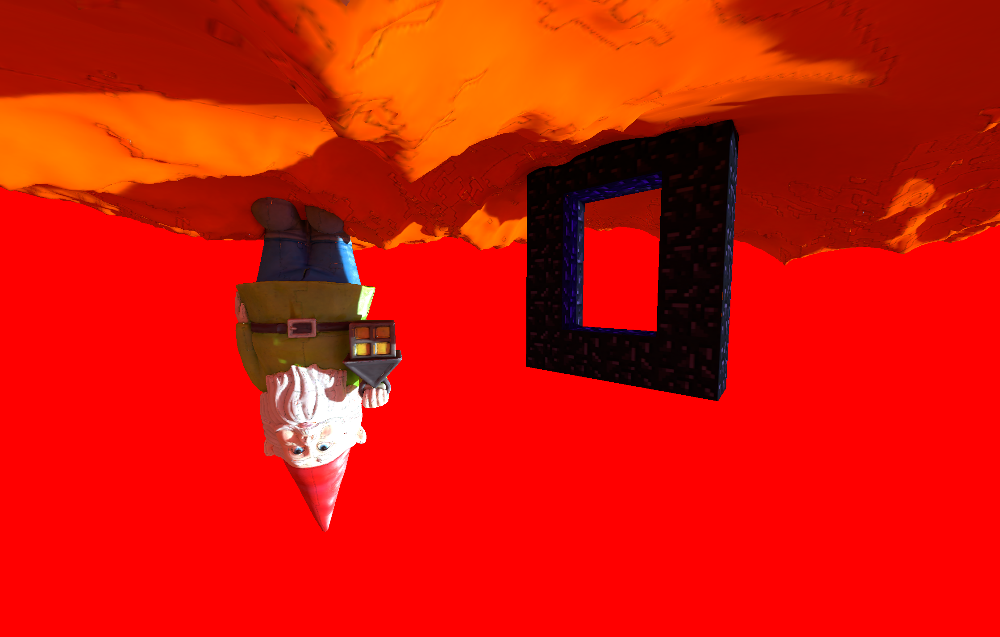
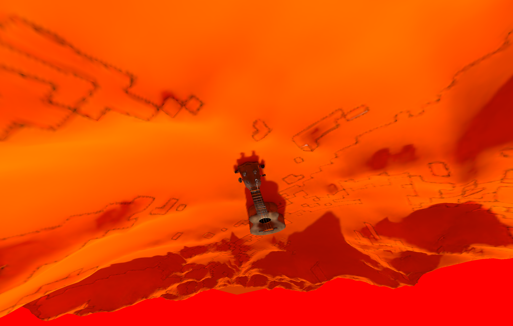
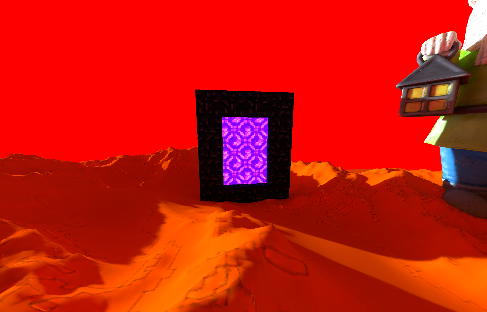
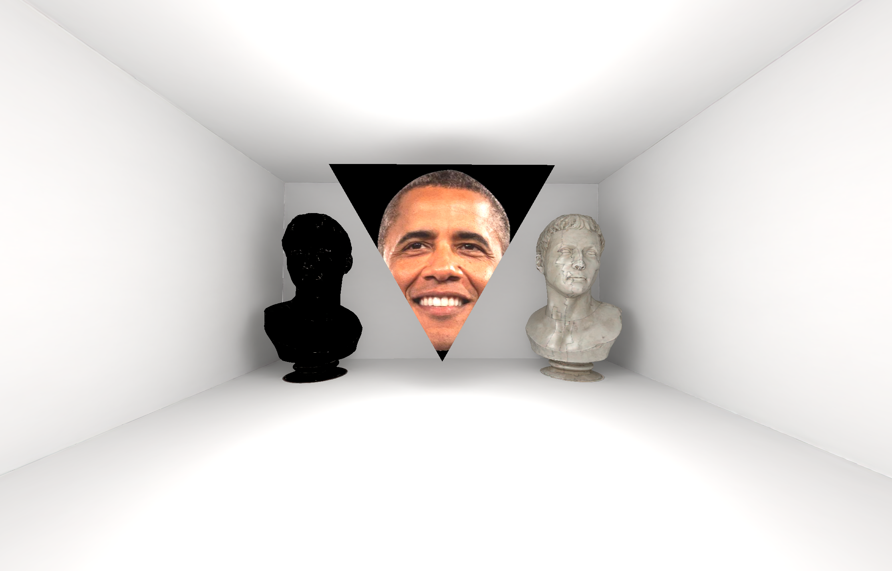

# lln-gamejam-2024

Entry for the 2024 edition of the [Louvain-li-Nux gamejam](https://louvainlinux.org/activites/game-jam).
Written in Go with custom WebGPU engine using the [`go-webgpu` bindings](https://github.com/rajveermalviya/go-webgpu), and (unfortunately) GLFW for windowing.
A custom physics and collision engine was also built.

Main lessons learned:

- Don't trust ChatGPT to write your matrix math.
- GLFW sucks (but we knew that already).
- Go is basically the perfect language for a gamejam.
- Debugging your graphics drivers is not an efficient use of your time during a gamejam.
- Quoicoubeh.

## Story

The theme for this gamejam was "Portals, inverted".

Alexis, who you play as, wakes up to a beautiful sunny morning in his room, ready to do his "Quoicouprière":



However, he ate too much garlic pasta the day before and deems it disrespectful to pray to the "Quoicoudieu" with an unclean mouth.

He thus goes on to his sink to brush his teeth but realizes his roommates have played a devious prank on him. They have reversed the hot and cold water! Furious, he decides to go to the "apatrimoine" to get his plumbing tools:



To his surprise, as he opens his door to exit his room, he sees through to another dimension!



He steps through as the world begins to turn upside down. He is put face to face with the "Apatien", the guardian of the apatrimoine, as well as an unlit Nether portal:



He greets the Apatien and asks him for a screwdriver, but the Apatien first wants him to play him a serenade, before lighting the Nether portal and shifting the world back to normal.

Stumped and disorientated, Alexis walks around the new dimension in order to find something he can play to the Apatien.
Luckily, he stumbles upon a ukulele:



Playing this ukulele flips the world back the right side up and lights the Nether portal:



Upon stepping through this portal, Alexis is put in front of his worst nightmare, unable to move:



Indeed, it is the Obama triangle!
During [a previous gamejam](https://github.com/obiwac/lln-gamejam-2023), Alexis only managed to create a triangle textured with a portrait of Obama.
Since then, he has been haunted by this image.
The only thing that scares Alexis more than the Obama triangle is bloom, which luckily we didn't have time to implement this time.

Obama explains to him that only the hot/cold stickers on the tap were switched around, not the actual plumbing, so he didn't even have to go get his plumbing tools in the apatrimoine in the first place.
Unfortunately, Alexis is still immobile, and will have to spend the rest of eternity stuck with the Obama triangle.

## Building

On Linux/FreeBSD with X11 or macOS:

```console
go build
```

On Linux/FreeBSD with Wayland:

```console
go build -tags wayland
```

These will create a `quoicoubeh` executable which you can run directly:

```console
./quoicoubeh
```

### Extra notes for FreeBSD

The way `go-webgpu` works is by distributing pre-compiled static libraries for WebGPU (`libwgpu_native.a`) for Linux and macOS.
These don't exist on FreeBSD, so you must build it yourself:

```console
git clone https://github.com/gfx-rs/wgpu-native
cd wgpu-native
git checkout 2773864
git submodule update --init --recursive .
cargo build --release
cp target/release/libwgpu_native.* /usr/local/lib
```

We must checkout to `2773864` because subsequent commits remove the `wgpuSwapChain*` functions which are currently required for `go-webgpu`.
This isn't an issue for other platforms as they are distributed a version which still has these functions.

It also needs to be modified to support FreeBSD in `wgpuext/glfw`, by creating a `~/go/pkg/mod/github.com/rajveermalviya/go-webgpu/wgpuext/glfw@v0.1.1/surface_wayland_freebsd.go` file:

```go
// go:build freebsd && wayland

package wgpuext_glfw // import "github.com/rajveermalviya/go-webgpu/wgpuext/glfw"

import "C"

import (
        "unsafe"

        "github.com/go-gl/glfw/v3.3/glfw"
        "github.com/rajveermalviya/go-webgpu/wgpu"
)

func GetSurfaceDescriptor(w *glfw.Window) *wgpu.SurfaceDescriptor {
        return &wgpu.SurfaceDescriptor{
                WaylandSurface: &wgpu.SurfaceDescriptorFromWaylandSurface{
                        Display: unsafe.Pointer(glfw.GetWaylandDisplay()),
                        Surface: unsafe.Pointer(w.GetWaylandWindow()),
                },
        }
}
```

(X11 should be self-explanatory, you just need to change the `wayland` build constraint to `!wayland` and copy the rest of the contents from `surface_x11_linux.go`.)
(If you have any issues, first try to clean the build cache with `go clean -cache`.)

Finally, you need to add the following linker flags in `~/go/pkg/mod/github.com/rajveermalviya/go-webgpu/wgpu@v0.17.1/wgpu.go`:

```go
#cgo freebsd LDFLAGS: -lwgpu_native -lm -ldl
```

These are all things I'll hopefully fix in a bit :)

If you want to install the Vulkan validation layer (`VK_LAYER_KHRONOS_validation`):

```console
pkg install vulkan-validation-layers
```

### Extra notes for aquaBSD

Good luck.
